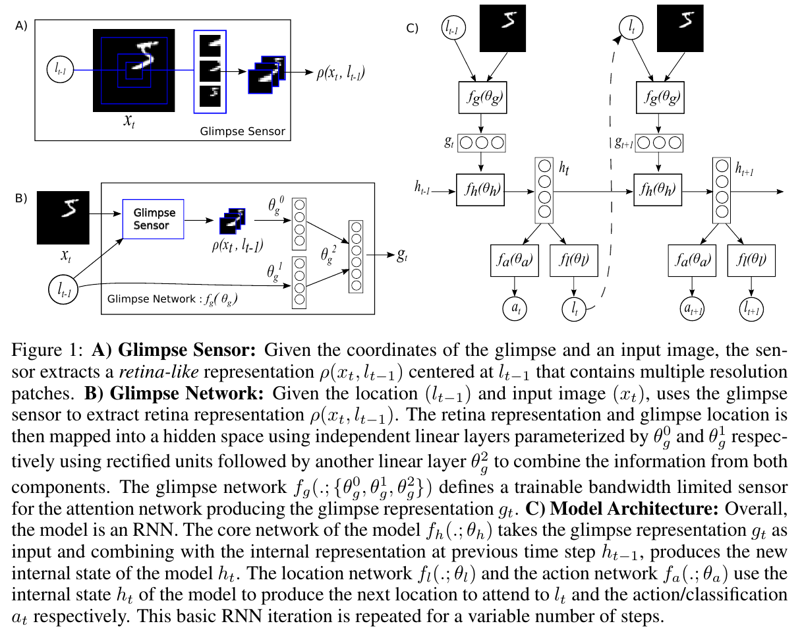
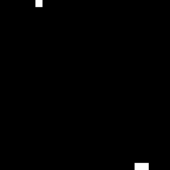
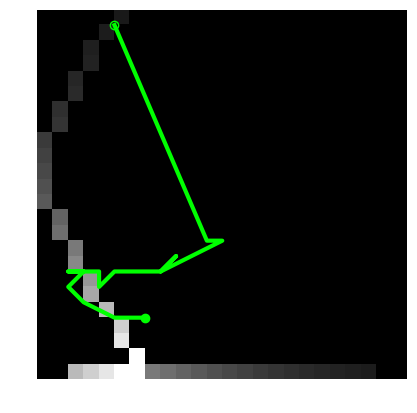
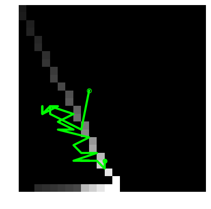
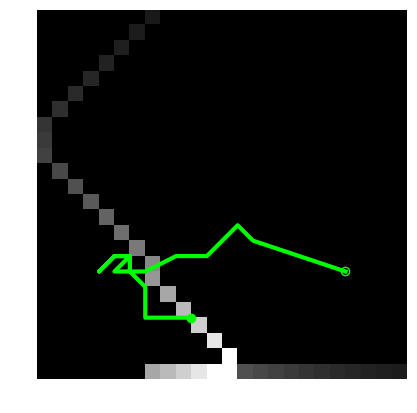

# Recurrent Model of visual Attention
 
- Pytorch implementation of _Mnih, Volodymyr, Nicolas Heess, and Alex Graves. "Recurrent models of visual attention." Advances in neural information processing systems. 2014._
 
## Recurrent Attention Model
 

 
## Implementation Details
- RAM for classification is defined in [`RAM.py`](RAM.py)
    - The core network is recurrent network
    - Action network is trained with supervised objective
    - Location network is trained with REINFORCE
- Individual experiments are implementated in [`RAM_centered.py`](RAM_centered.py),[`RAM_translated.py`](RAM_translated.py) and [`RAM_cluttered.py`](RAM_cluttered.py)
- Environment for game _Catch_ is defined in [`catch.py`](catch.py)
- RAM and experiment for _Catch_ are defined in [`RAM_catch.py`](RAM_catch.py)
    - The core network is LSTM
    - Action and location networks are trained with REINFORCE
    
## Tasks
- RAM is tested in 4 scenarios:
    - Classification of centered MNIST digit (size: 28x28)
    - Classification of translated MNIST digit (size: 60x60)
    - Classification of cluttered and translated MNIST digit (size: 60x60, 4 pieces of clutter of size 8x8)
    - Playing game _Catch_
    
### Classification of MNIST digits

#### Experiments
Hyper-parameters | Centered digit | Translated digit | Cluttered and Translated digit
--- | --- | --- | ---
Glimpse size | 8x8 | 12x12 | 12x12
Glimpse scale | 1 | 3 | 3
Initial learning rate | 0.001 | 0.0001 | 0.0001
Learning rate decay | 0.95 | 0.975 | 0.975
std of location policy | 0.25 | 0.25 | 0.25
Epochs | 100 | 200 | 200

#### Performance
Number of glimpses | Centered digit | Translated digit | Cluttered and Translated digit
--- | --- | --- | ---
2 | 89.54 | -     | -
3 | 94.48 | -     | -
4 | 96.82 | 89.35 | 83.00
5 | 97.09 | -     | -
6 | 97.54 | 91.74 | 85.50
7 | 97.57 | -     | -
8 | -     | 92.61 | 85.46

#### Visualization

_Visualization of policy on non-centered digit classification task for T=8. (a) Digit with gaze track (b) individual glimpses. Each column shows single glimpse with patches of decreasing scale from top to bottom. Intermediate predictions are shown on the top._

### Playing _Catch_

#### Experiments
Hyper-parameters | values
--- | --- 
Glimpse size | 6x6 
Glimpse scale | 3
Initial learning rate | 0.0001
Learning rate decay | 0.99
std of location policy | 0.25
Training episodes | 15 million

#### Performance
Agent achieves ~89% accuracy.

#### Visualization
- Agent playing the game below

 |  |  | 
---|---|---|---

- Gaze-track on recency-based weighted average of frames from the game

 |  |  | 
---|---|---|---

